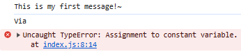
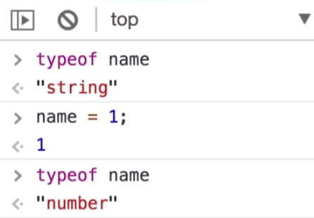
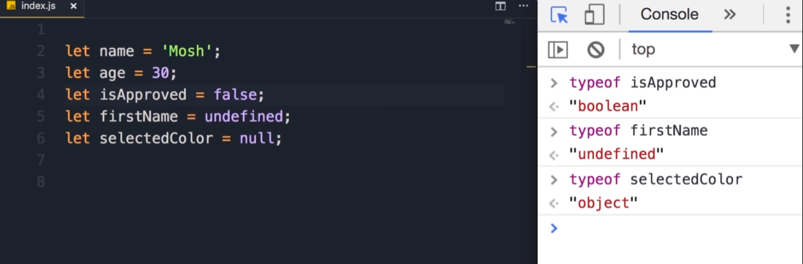
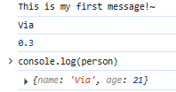
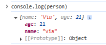
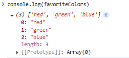

## What is JavaScript?

JavaScript is an object-oriented computer programing language commonly used to create interactive effects within we browsers.

**JavaScript** can be used to create things like
- Web/Mobile Apps
- Real-Time Networking Apps
- Command-line Tools
- Games

``` title='gemini'
JavaScript primarily runs in web browsers on the client-side, enabling dynamic and interactive web pages. Each major web browser includes a built-in JavaScript engine responsible for executing the code. Examples of these engines include V8 in Chrome, SpiderMonkey in Firefox, and JavaScriptCore in Safari.

Beyond the browser, JavaScript can also run on the server-side using a runtime environment like Node.js. Node.js utilizes the V8 engine to allow JavaScript to be used for server-side development, building APIs, and various other backend applications.
```
## Setting Up the Development Environment

You will first need an **editor**

- **Visual Studio Code ([VSCode](https://code.visualstudio.com/))**
- Sublime Text
- Atom

## HTML SHORTCUT

Write:

```
!
```

and 'tab', this will generate some basic HTML boilerplate.

```html title='index.html'
<!DOCTYPE html>

<html lang="en">

<head>
    <meta charset="UTF-8">
    <meta name="viewport" content="width=device-width, initial-scale=1.0">
    <title>Document</title>
</head>
<body>
</body>
</html>
```

We are going to use this to host our JavaScript code.

Install [Live Server](https://marketplace.visualstudio.com/items?itemName=ritwickdey.LiveServer). We are going to use this to server our web application.

Right click `index.html` and select `Open with Live Server`.
It will open at this address.
```
http://127.0.0.1:5500/js-basics/index.html
```

## JavaScript in Browsers

In order to have JavaScript code in `index.html`, we need a **script element**.

There are two places where we can add a script element: the **head section** or in the **body section**.

The best practice is to append the **script element** to the end of the **body section**.

This is done for **two** reasons:

The browser parses the html file from **top to bottom** such that if the JavaScript snippet is in the header/at the top, it will need to be parsed and executed before any other elements are loaded. Essentially the website will be blank until the browser is done with the JavaScript.

The other reason is that the other elements need to be rendered before the JavaScript is parsed and executed, and thus interacting with the rendered elements.

**Your first JavaScript Message**
```html title='index.html'
<!DOCTYPE html>
<html lang="en">
<head>
    <meta charset="UTF-8">
    <meta name="viewport" content="width=device-width, initial-scale=1.0">
    <title>Document</title>
</head>
<body>
    <h1>JavaScript Basics</h1>
    BODY
    <script>
        // This is my first JavaScript code for this tutorial
        console.log("This is my first message!~");
    </script>
</body>
</html>
```


## Separation of Concerns

We want to separate HTML and JavaScript in the interests of readability and modular code structure. The HTML file references the CSS file for styling and the JavaScript file for functionality.

This approach can be done by creating a file `index.js`.

Move the JavaScript Snippet to its own file.
```js title='index.js'
// This is my first JavaScript code for this tutorial
console.log("This is my first message!~");
```

In the html file `index.html`, reference `index.js` by editing the script tags as follows.
```html title='index.html'
<script src="index.js"></script>
```


## JavaScript in Node

Assuming you have node installed.

Making sure that you are in the same directory, if you run `node index.js`, it should return the output of the JavaScript `This is my first message!~`.

Reminder that in `VS Code`, `` ctrl + ` `` will open the terminal.

## Variables

**Variables** are used to store data temporarily. A **variable** is like a box with a label.

```js title='index.js'
let name;
console.log(name); // This will log 'undefined' since name is not initialized
```

**Reminder** that **variables** cannot use **reserved**  keywords   and should be meaningful. They also cannot start with a number i.e. 1name and cannot contain a space or hyphen (-).

Should use **camelNotation**.
## Constants

In this JavaScript Snippet, it changes the value of the variables and thus the output changes.

```js title='index.js'
let interestRate = 0.3;
interestRate = 1;
console.log(interestRate); // This will log 1, as the value has been updated
```

In the case this is unwanted behavior and will cause bugs, we use **constants**. It is notated accordingly.

```js title='index.js'
const interestRate = 0.3;
interestRate = 1;
console.log(interestRate); // This will log 1, as the value has been updated
```

In this case the console will return an "Uncaught TypeError: Assignment to constant variable"


If you do not need reassign a variable, the best practice is to use `const`, otherwise use `let`.

## Primitive Types

What types exist in JavaScript. There exists two categories of types: **primitives** and **reference.**

- String
- Number (includes floating-point number and integers)
- Boolean
- undefined
- null

| Variable Type | Declaration Keyword | Scope/Behavior                              | Example                            |
| ------------- | ------------------- | ------------------------------------------- | ---------------------------------- |
| Number        | `let`, `const`      | Holds numeric values                        | `let age = 25;`                    |
| String        | `let`, `const`      | Holds text values                           | `const name = "Tony";`             |
| Boolean       | `let`, `const`      | Holds `true` or `false`                     | `let isActive = true;`             |
| Undefined     | `let`, `const`      | Default value for uninitialized variables   | `let data;`                        |
| Null          | `let`, `const`      | Represents intentional absence of any value | `let selected = null;`             |
| Object        | `let`, `const`      | Collection of key-value pairs               | `const user = {name: "Tony"};`     |
| Array         | `let`, `const`      | Ordered list of values                      | `let numbers = [1,2,3];`           |
| Symbol        | `const`             | Unique and immutable primitive value        | `const id = Symbol("id");`         |
| BigInt        | `let`, `const`      | Arbitrary precision integer                 | `let big = 12345678901234567890n;` |

## Dynamic Typing

The difference between JavaScript and other languages is that JavaScript is dynamic. This means that the type of a variable can change in the same script unlike with **static** languages.



**Tip:** Terminal can be cleared with `ctrl + L`



## Objects

An **Object** is one of the three **reference** types.

Among the **reference** types are:
- Object
- Array
- Function

An **Object** is  an entity with specific **properties**.

An example would be a person with properties such as gender, age, name, and height. Another example would be a car with properties: color, topSpeed, Engine, etc.

So when multiple variables are related, they can be wrapped in an object.

Here is an example rendering.

```
User Profile
------------
Name:         Alice Johnson
Age:          27
Email:        alice@example.com
Occupation:   Software Engineer
Location:     Seattle, WA
Verified:     true

Preferences
-----------
Theme:        Dark
Language:     English
Notifications:
    Email:    true
    SMS:      false
    Push:     true

```

Where the JavaScript file could look like:

```js title='index.js'
const user = {
    name: "Alice Johnson",
    age: 27,
    email: "alice@example.com",
    occupation: "Software Engineer",
    location: "Seattle, WA",
    verified: true,
    preferences: {
        theme: "Dark",
        language: "English",
        notifications: {
            email: true,
            sms: false,
            push: true
        }
    }
};

```

A **person** object can be declared

```js title='index.js'
let person = {
  name: "Via",
  age: 21,
}; // {} is called an object literal
```

The properties declared above are called key value pairs.

Using `console.log(person)`, the following is returned.


There are two ways to interact with an object's **key** or **property**.

- Dot Notation
- Bracket Notation

**Dot Notation**

This can be used to alter the property of an object or read a specific property.

```js title='index.js'
person.name = 'John';

console.log(person.name);
```

**Bracket Notation**

```js title='index.js'
person['name'] = 'Ciel';

console.log(person.name);
```

Dot Notation is more concise and shorter, so it should be your default.

Bracket Notation can be useful if the property is only known at runtime.

```js title='example'
let selection = 'name';
person[selection] = 'someProperty';
```

## Arrays

An **array** is a data structure used to represent a list of items.

```js title=index.js
let favoriteColors = ["red", "green", "blue"];
```



A specific element of index 2 can be logged like so.

```js title='example'
console.log(favoriteColors[2]);
```

**Reminder** that JavaScript is dynamic which means that an array can hold elements of different **types** and possess a different **length**.

## Functions

**Functions** are one of the fundamental building blocks in JavaScript. A **Function** are a set of statements that perform a task or calculates a value.

Here is an example of a function `greet` that takes a `name` as a parameter such that it returns `Hello, <name>`!


```js title='index.js'
function greet(name) {

  console.log("Hello, " + name + "!");

}

greet("Via"); // This will log 'Hello, Via!'
```

**Reminder** that parameters are **variables** that are only meaningful within the scope of the **function**. Where `name` is a parameter and `Via` is an argument.

If a function has multiple parameters but given one argument, the rest of the **parameters** will be defined as **undefined**.

## Types of Functions

- Performative
- Calculative

The above function is a **performative** function, it greets someone. Below is an example of a **calculative** function.

```js title='example'
function square(number) {
  return number * number;
}

let number = square(2);
```


